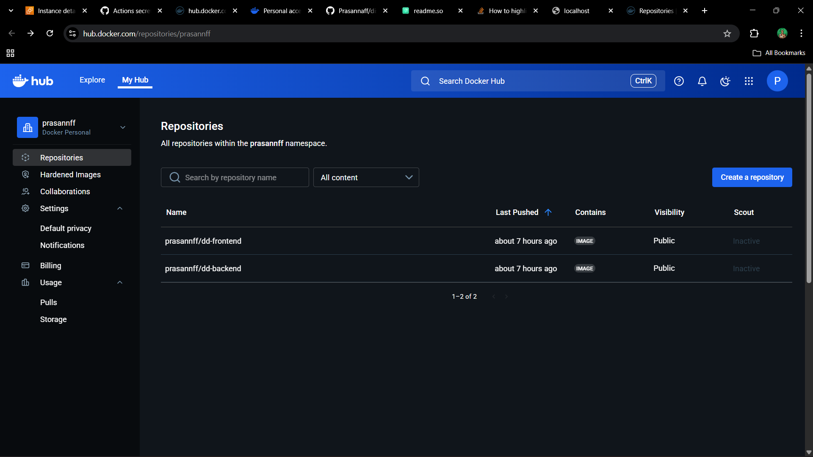
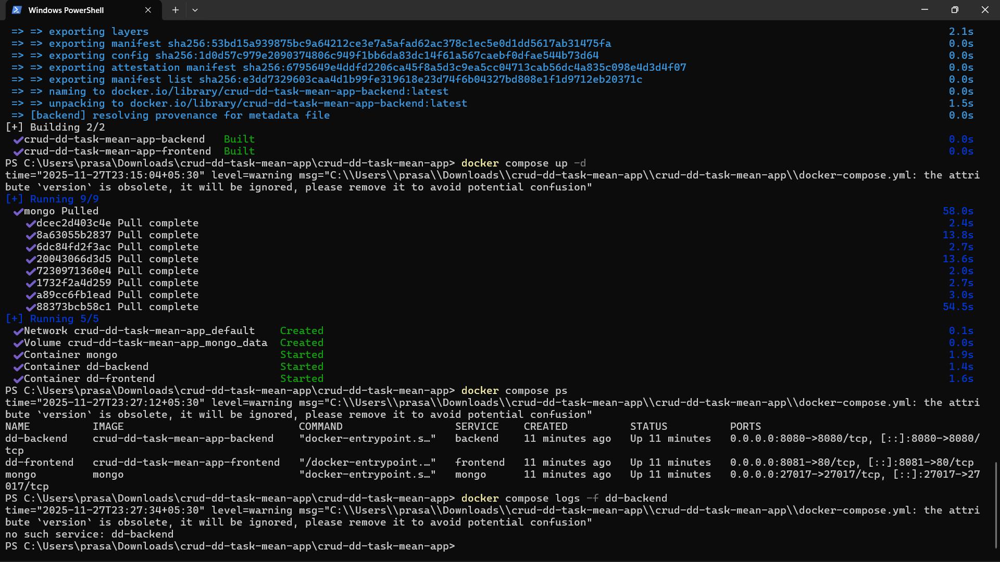
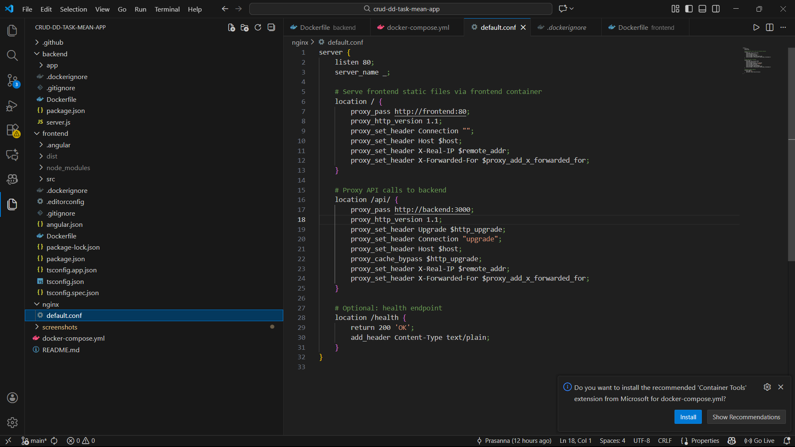
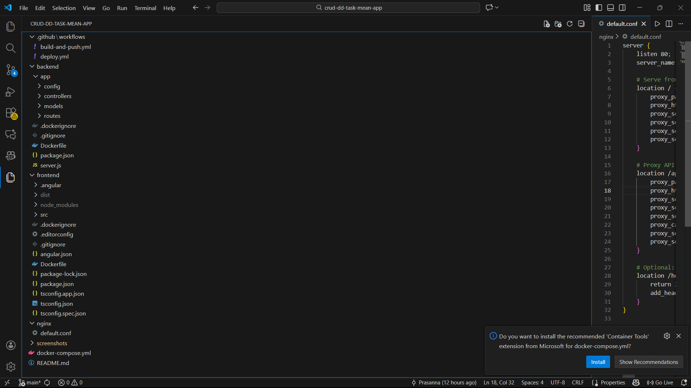

# 🚀 Discover Dollar – DevOps Assignment

This project is a full-stack **CRUD application** built using the **MEAN stack** (MongoDB, Express.js, Angular 15, Node.js).  
The objective of this assignment is to **containerize, deploy, and automate** the MEAN application using:

- Docker & Docker Hub  
- Docker Compose  
- Nginx Reverse Proxy  
- AWS EC2 (Ubuntu)  
- GitHub Actions (CI/CD Pipeline)

---

# 📌 1. Application Overview

The application manages **Tutorials**, each containing:

- `id`
- `title`
- `description`
- `published` (boolean)

Users can:
- Create Tutorials  
- View Tutorials  
- Update Tutorials  
- Delete Tutorials  
- Search Tutorials by Title  

Technologies used:
- Backend: **Node.js + Express.js**
- Frontend: **Angular 15**
- Database: **MongoDB**
- Deployment: **Docker, Nginx, AWS EC2, GitHub Actions**

---

# 🛠️ 2. Local Development Setup

## 🔹 Backend (Node.js + Express)

```bash
cd backend
npm install
npm start
# or
node server.js
```

## To use a local MongoDB:

```bash
MONGO_URI=mongodb://localhost:27017/tutorials
```

## Backend default URL: http://localhost:3000/

## 🔹 Frontend (Angular)
```bash
cd frontend
npm install
ng serve --port 8081
```

## Open browser at: http://localhost:8081/

# 🐳 3. Dockerization
## 🔹 Build Backend Image
```bash 
docker build -t prasannff/dd-backend:latest -f backend/Dockerfile backend
```

## 🔹 Build Frontend Image
```bash
docker build -t prasannff/dd-frontend:latest -f frontend/Dockerfile frontend
```
## 🔹 Push Images to Docker Hub
```bash
docker login
docker push prasannff/dd-backend:latest
docker push prasannff/dd-frontend:latest
```
## Docker Hub:

### Backend → https://hub.docker.com/r/prasannff/dd-backend

### Frontend → https://hub.docker.com/r/prasannff/dd-frontend

# 🧩 4. Docker Compose

## To deploy MongoDB + Backend + Frontend + Nginx:
```bash
docker compose pull
docker compose up -d
```
## Check running services:
```bash
docker compose ps
```
# 🌐 5. AWS EC2 Deployment
## 1️⃣ Launch Ubuntu EC2 Instance

Ubuntu 22.04

t3.micro (Free Tier)

## 2️⃣ SSH into server
```bash
ssh -i your-key.pem ubuntu@<EC2_PUBLIC_IP>
```
## 3️⃣ Install Docker & Docker Compose

(Performed during setup)

## 4️⃣ Clone project
```bash
git clone https://github.com/Prasannaff/discoverdollar-devops-assignment.git
cd discoverdollar-devops-assignment
```
## 5️⃣ Start containers
```bash
docker compose pull
docker compose up -d
```

App is now live:
👉 http://<EC2_PUBLIC_IP>
👉 https://<your-domain> (if HTTPS configured)

## 🔁 6. Nginx Reverse Proxy

File: nginx/default.conf
```bash
server {
    listen 80;

    location / {
        root /usr/share/nginx/html;
        try_files $uri $uri/ /index.html;
    }

    location /api {
        proxy_pass http://backend:3000;
    }
}
```

Serves Angular build files

Routes /api → Node backend

## 🔄 7. GitHub Actions CI/CD

The pipeline:

✔ Builds backend Docker image
✔ Builds frontend Docker image
✔ Pushes images to Docker Hub
✔ SSH into EC2
✔ Pulls new images
✔ Restarts containers automatically

Workflow file:
```bash
.github/workflows/deploy.yml
```

Trigger:
✔ Runs automatically on every push to main

## 🔐 8. GitHub Secrets (Required for CI/CD)
Add these in:
Repo → Settings → Secrets → Actions

| Secret Name        | Value                   |
| ------------------ | ----------------------- |
| DOCKERHUB_USERNAME | prasannff               |
| DOCKERHUB_TOKEN    | Docker Hub Access Token |
| VM_HOST            | <EC2_PUBLIC_IP>         |
| VM_USER            | ubuntu                  |
| VM_SSH_KEY         | Entire PEM private key  |

## 📸 9. Final Output & Required Screenshots
```bash
http://<EC2_PUBLIC_IP>
```

# 📸 Screenshots

Below are the required screenshots for the DevOps assignment.  
(Replace the placeholder text with your actual screenshots.)

---

## 1️⃣ Docker Hub Images
> Screenshot showing `prasannff/dd-frontend` and `prasannff/dd-backend` in Docker Hub.



---

## 2️⃣ GitHub Actions – Successful CI/CD Run
> Screenshot of GitHub Actions workflow with ✔ success indicators.


---

## 3️⃣ EC2 Running Containers (`docker compose ps`)
> Run `docker compose ps` on EC2 and take a screenshot showing all services running:
- backend  
- frontend  
- mongo  
- nginx  



---

## 4️⃣ Live Application UI
> Screenshot of the deployed application running in the browser.  
URL: `http://<your-ec2-ip>`


---

## 5️⃣ Nginx Reverse Proxy Configuration
> Screenshot of the file `nginx/default.conf`.



---

## 6️⃣ Repository Folder Structure
> Screenshot from GitHub repo showing:
- backend  
- frontend  
- nginx  
- docker-compose.yml  
- .github/workflows  



---

## 7️⃣ GitHub Actions Workflow File (`deploy.yml`)
> Screenshot of `.github/workflows/deploy.yml`.


---
