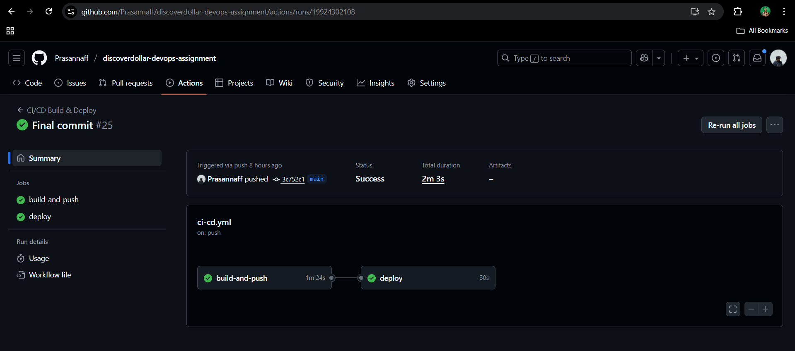
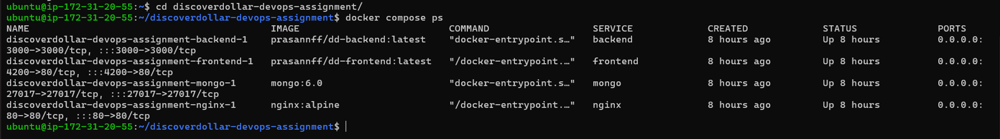
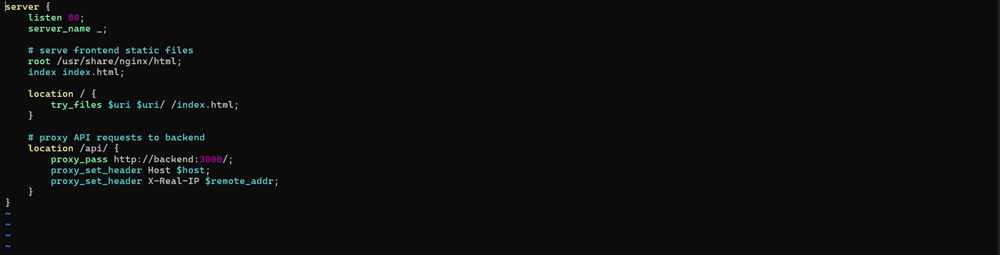
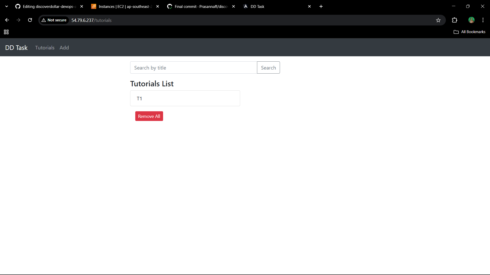
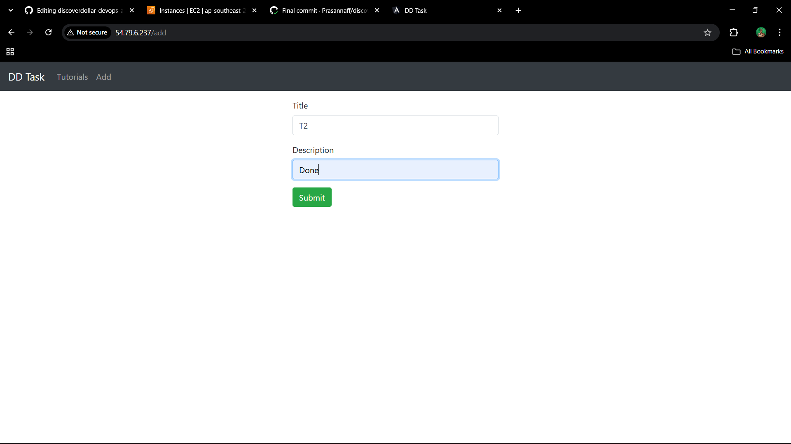
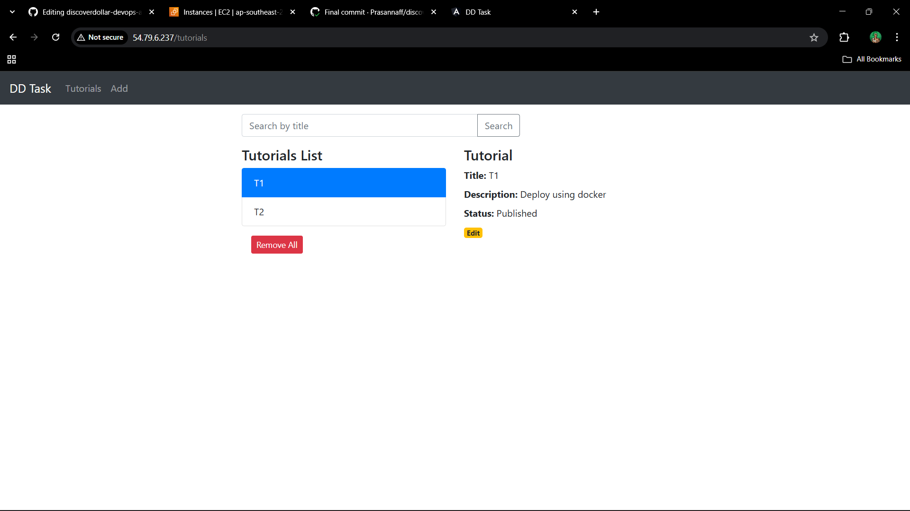
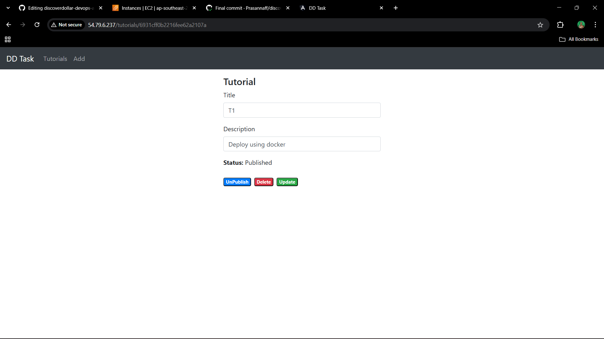

# 🚀 MEAN Stack CI/CD Deployment using GitHub Actions & Docker

This project showcases an end-to-end DevOps deployment pipeline for a MEAN Stack CRUD Application using:

- **Docker & Docker Compose**
- **Docker Hub**
- **NGINX Reverse Proxy**
- **GitHub Actions CI/CD**
- **AWS EC2 Ubuntu Server**

The goal of the assignment is to **containerize, deploy, and automate application delivery with zero manual intervention after code commits.**

---

## 🧱 Architecture
```bash
GitHub → GitHub Actions → Docker Build → Docker Hub → AWS EC2 → Docker Compose → NGINX → User
```

### Services Included
```bash
| Component | Role |
|----------|------|
| Angular App | Frontend UI |
| Node.js + Express | REST API backend |
| MongoDB | Database |
| NGINX | Host frontend & reverse proxy to backend |

```
## 📌 Key DevOps Features
```bash
| Feature | Status |
|--------|:-----:|
| Containerized Frontend & Backend | ✅ Done |
| Docker Images stored in Docker Hub | ✅ Done |
| GitHub Actions CI/CD Pipeline | ✅ Fully Automated |
| Reverse Proxy using NGINX | ✅ Configured |
| Secure Deployment on AWS EC2 | ✅ Live |
| MongoDB Data Persistence | ✅ Using Docker Volume |
```

## 📂 Repository Structure
```bash
discoverdollar-devops-assignment
│
├── backend/ → Express API + Dockerfile
├── frontend/ → Angular Build + Dockerfile
├── nginx/ → Reverse Proxy Config
├── docker-compose.yml
├── .github/workflows/deploy.yml → CI/CD Pipeline
└── screenshots/ → Deployment Proofs
```

## 🔧 DevOps Implementation

### 1️⃣ Docker Setup
- Created separate **Dockerfiles** for frontend and backend  
- Configured **production Angular build** and served using **NGINX**  
- Configured **environment variables** for backend → MongoDB connection  

### 2️⃣ Docker Hub Integration

Images pushed to Docker Hub:
```bash
| Service | Docker Hub Image |
|--------|------------------|
| Frontend | `prasannff/dd-frontend:latest` |
| Backend | `prasannff/dd-backend:latest` |
```
Used during EC2 deployment through Docker Compose.


### 3️⃣ GitHub Actions CI/CD

Whenever code is pushed to **main** branch:

✔ Builds frontend + backend Docker images  
✔ Tags & pushes them to Docker Hub  
✔ SSH into EC2 server  
✔ Pulls latest images  
✔ Restarts containers automatically  

📌 Pipeline Location:
```bash
.github/workflows/deploy.yml
```
## 🔐 GitHub Secrets Configuration
```bash
| Secret Name | Description |
|------------|-------------|
| DOCKERHUB_USERNAME | DockerHub login |
| DOCKERHUB_TOKEN | Docker Hub Access Token |
| VM_HOST | EC2 Public IP |
| VM_USER | ubuntu |
| VM_SSH_KEY | Private Key PEM content |

> Fully secure → No credentials stored directly in the repository
```
## 🌍 AWS Deployment
```bash
- EC2 Ubuntu 22.04 instance
- Docker & Docker Compose installed
- GitHub Actions deploys latest build on every push
```
### Command
```bash
docker compose ps
```
📌 Application URL:
```bash
http://<EC2_PUBLIC_IP>
```
🔁 NGINX Reverse Proxy
Hosts Angular production build

Routes /api calls → backend container

Eliminates CORS issues

Ensures single domain routing

📌 Config file:

```code
nginx/default.conf
```
💾 Data Persistence
MongoDB uses a named Docker volume, ensuring data survives container restarts and deployments.

## SCREENSHOTS

### Docker Images in Docker Hub (frontend + backend)

### GitHub Actions Pipeline Successful

### EC2 instance running containers

### NGINX Reverse Proxy config in container

### Live UI




